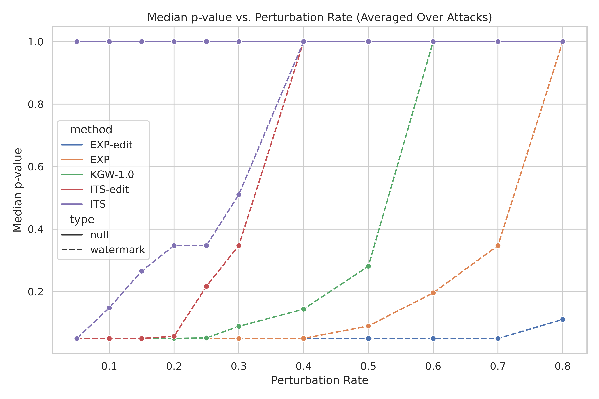
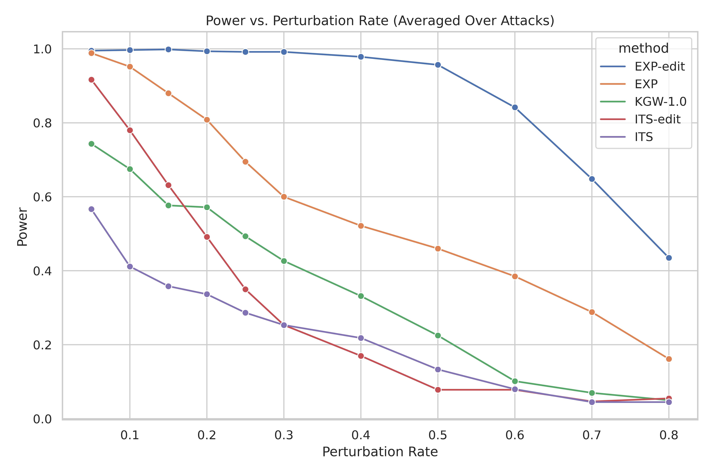
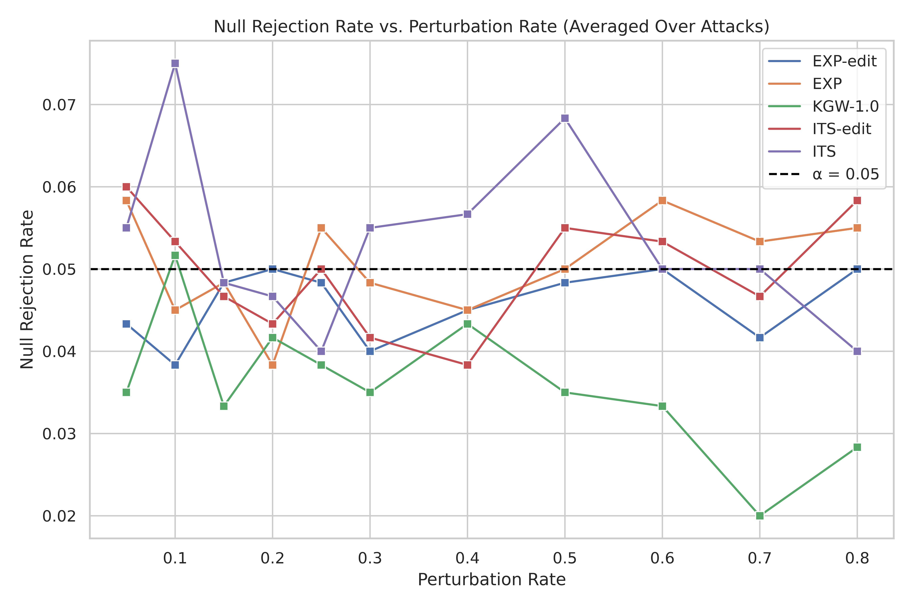
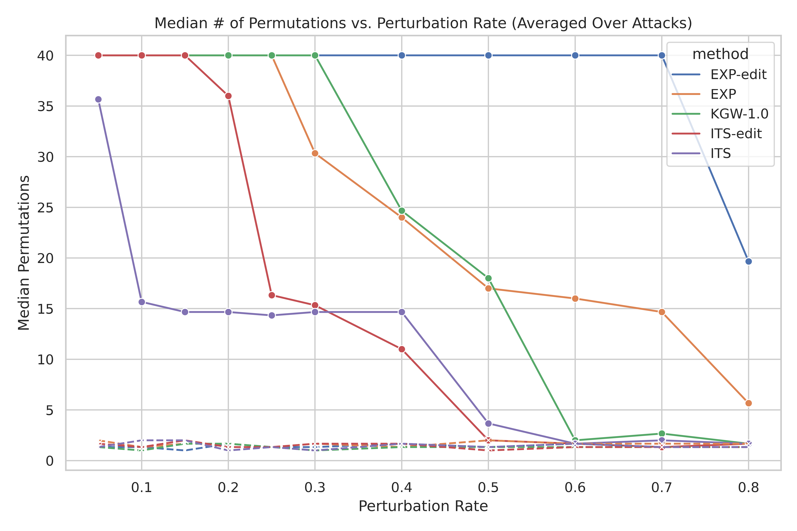
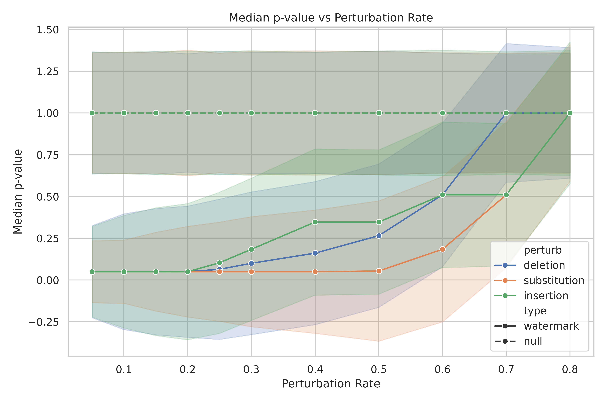
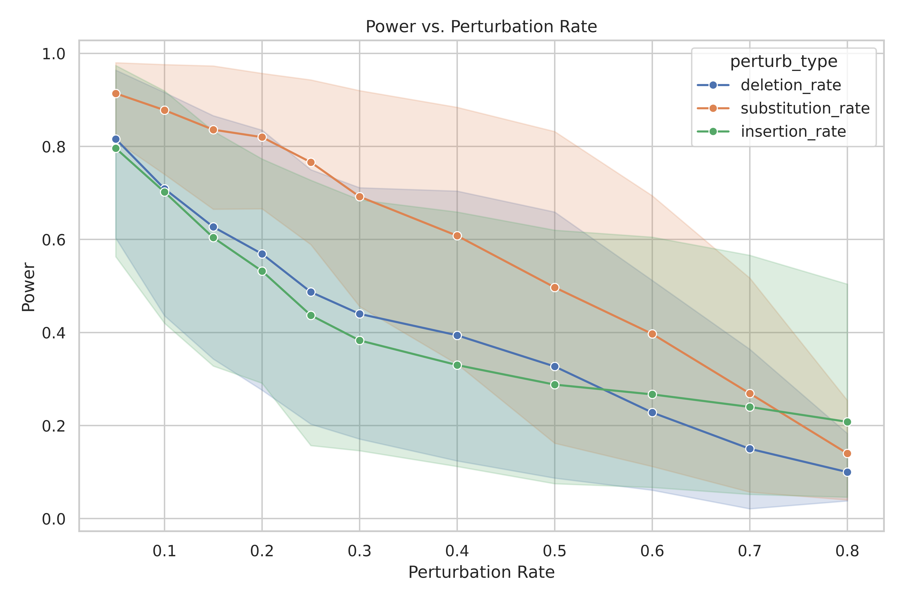
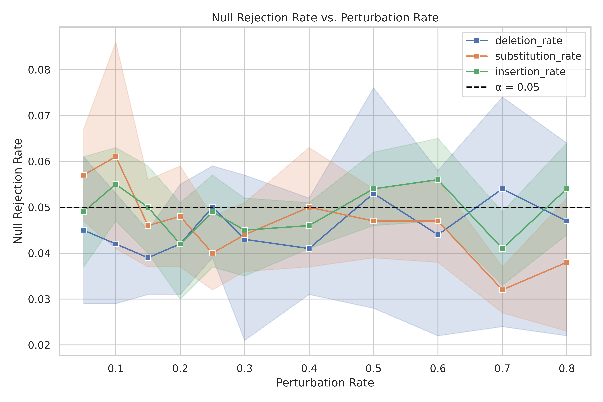
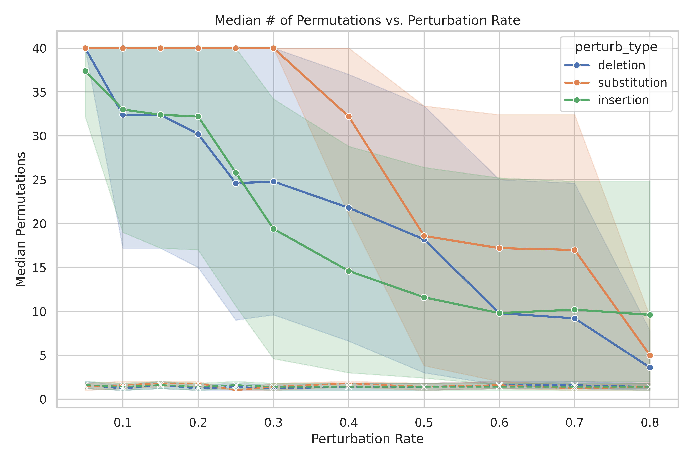

# (Sequential) Robust Distortion-free Watermarks for Language Models

Slight modification of the methods described in [Robust Distortion-free Watermarks for Language Models](https://arxiv.org/abs/2307.15593). Original repo [here](https://github.com/jthickstun/watermark).


We just replace the full permutation test in the `detect` algorithm to the sequential monte carlo (test-by-betting) test presented by [Fischer et al](https://arxiv.org/abs/2401.07365) (Algorithm 3). The hope is to make the test faster without sacrificing power or Type I error. 
# Running the Experiments

To run the experiments, follow these steps:

1. **Create and activate the environment, and run the experiment scripts:**

   ```bash
   # Create the environment
   conda create --name <env> --file requirement.txt

2. **Activate your new environment**
   conda activate <env>
3. **Run the experiment scripts**

   # Power curve experiments
   ./experiments/scripts/experiment-power-curve.sh <save directory path> facebook/opt-1.3b

   # Deletion perturbation experiments
   ./experiments/scripts/experiment-del.sh <save directory path> facebook/opt-1.3b

   # Insertion perturbation experiments
   ./experiments/scripts/experiment-ins.sh <save directory path> facebook/opt-1.3b

   # Substitution perturbation experiments
   ./experiments/scripts/experiment-sub.sh <save directory path> facebook/opt-1.3b

Here are results that we got, using $\alpha = 0.05$ and (Algorithm 3) $c=0.04$:
<p align="center">
  
  
</p>

<p align="center">
  
  
</p>

<p align="center">
  
  
</p>

<p align="center">
  
  
</p>

<p align="center">
  
  
</p>


## References
```bib
@article{kuditipudi2023robust,
  title={Robust Distortion-free Watermarks for Language Models},
  author={Kuditipudi, Rohith and Thickstun, John and Hashimoto, Tatsunori and Liang, Percy},
  journal={arXiv preprint arXiv:2307.15593},
  year={2023}
}
```

```bib
@misc{fischer2024sequentialmontecarlotestingbetting,
      title={Sequential Monte-Carlo testing by betting}, 
      author={Lasse Fischer and Aaditya Ramdas},
      year={2024},
      eprint={2401.07365},
      archivePrefix={arXiv},
      primaryClass={stat.ME},
      url={https://arxiv.org/abs/2401.07365}, 
}
```
