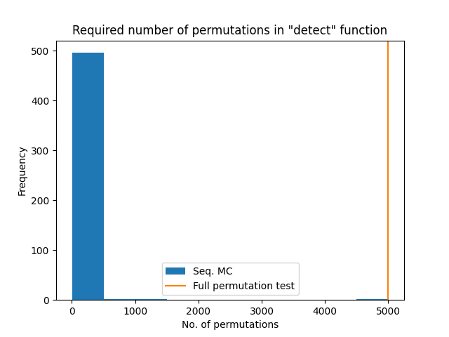
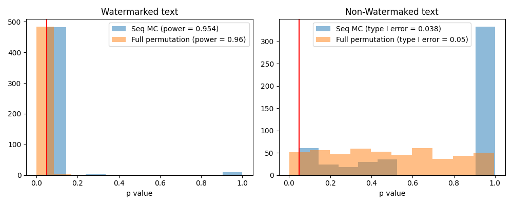

# (Sequential) Robust Distortion-free Watermarks for Language Models

Slight modification of the methods described in [Robust Distortion-free Watermarks for Language Models](https://arxiv.org/abs/2307.15593). Original repo [here](https://github.com/jthickstun/watermark).


We just replace the full permutation test in the `detect` algorithm to the sequential monte carlo (test-by-betting) test presented by [Fischer et al](https://arxiv.org/abs/2401.07365) (Algorithm 3). The hope is to make the test faster without sacrificing power or Type I error. 

Some preeliminary results on the C4 experiments, using $\alpha = 0.05$ and (Algorithm 3) $c=0.04$:






## References
```bib
@article{kuditipudi2023robust,
  title={Robust Distortion-free Watermarks for Language Models},
  author={Kuditipudi, Rohith and Thickstun, John and Hashimoto, Tatsunori and Liang, Percy},
  journal={arXiv preprint arXiv:2307.15593},
  year={2023}
}
```

```bib
@misc{fischer2024sequentialmontecarlotestingbetting,
      title={Sequential Monte-Carlo testing by betting}, 
      author={Lasse Fischer and Aaditya Ramdas},
      year={2024},
      eprint={2401.07365},
      archivePrefix={arXiv},
      primaryClass={stat.ME},
      url={https://arxiv.org/abs/2401.07365}, 
}
```
